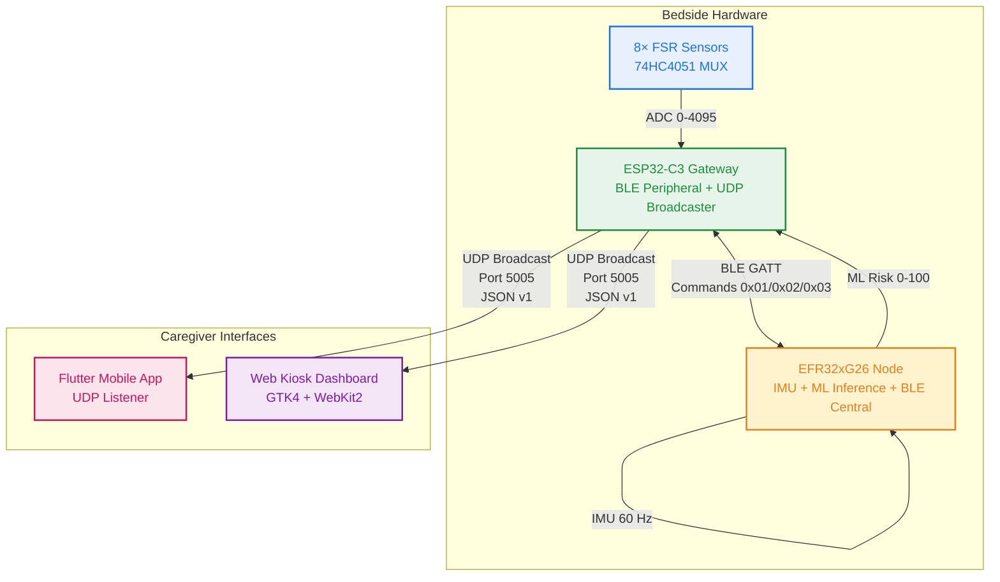

# VitalSense Pressure Ulcer Prevention System

## Overview

VitalSense is an end-to-end pressure ulcer prevention system for bedridden patients. It combines an 8-sensor force-sensing resistor (FSR) array, inertial measurement unit (IMU), on-device machine learning inference, and real-time caregiver dashboards to continuously monitor posture, pressure distribution, and tissue injury risk across four anatomical zones (head, shoulders, hips, heels).

## System Architecture



## Hardware Requirements

| Component | Part Number | Quantity | Role |
|-----------|-------------|----------|------|
| ESP32-C3 Development Board | ESP32-C3-DevKitM-1 / SuperMini | 1 | FSR acquisition, BLE peripheral, UDP broadcaster |
| EFR32xG26 Development Kit | BRD2608A (xG26) | 1 | IMU posture detection, ML inference, BLE central |
| Force Sensing Resistors | Interlink FSR 402 / equivalent | 8 | Pressure sensing at anatomical zones |
| Analog Multiplexer | 74HC4051 / CD4051 | 1 | 8-channel to single ADC |
| Inertial Measurement Unit | ICM-40627 (on xG26 board) | 1 | 6-axis motion, posture classification |
| Power Supply | 5V 2A USB-C | 2 | ESP32-C3 and EFR32xG26 power |

## Component Breakdown

| Component | Location | Technology Stack | Primary Responsibility |
|-----------|----------|------------------|------------------------|
| ESP32-C3 Firmware | `projects/Pipeline/ESP32 firmware/` | Arduino Core, NimBLE-Arduino 2.3.7 | 8-channel FSR acquisition via MUX, BLE GATT server, plate averaging, UDP JSON broadcast (1 Hz) |
| EFR32xG26 Firmware | `projects/Pipeline/EFR xG26 firmware/bt_imu_mode/` | C, Silicon Labs Gecko SDK 2026.6, TFLite Micro | IMU calibration (CENTER/LEFT/RIGHT), posture tracking at 60 Hz, BLE central connection to ESP32, ML inference, risk/state transmission |
| ML Model | `projects/Pipeline/model/` | PyTorch, ONNX, TensorFlow Lite | 380-parameter MLP (12→16→8→4), risk prediction 0-100 per zone, deployed as TFLite on EFR32 |
| Synthetic Dataset Kit | `projects/Pipeline/Synthetic dataset kit/` | Python, Pandas, PyTorch, scikit-learn | 60,000-sample synthetic dataset generation, teacher risk function, model training pipeline, ONNX/TFLite export |
| Mobile App | `projects/vitalsense-app/` | Flutter 3.x, Dart 3.x | UDP listener (port 5005), real-time gauges, posture duration, risk visualization, diagnostics panel |
| Web Dashboard | `projects/vitalsense-dashboard/` | Python 3.10+, GTK4, WebKit2GTK, React (JSX) | Kiosk-mode UDP receiver, HTTP frontend (port 8080), WebView display, SSE live updates |

## Communication Protocols

### BLE GATT (EFR32xG26 ↔ ESP32-C3)

| Parameter | Value |
|-----------|-------|
| Target Device Name | `VitalSense-ESP32C3` |
| Service UUID | `7a0a0001-5b8a-4f4c-9d1d-8b4e3d7a1000` |
| RX Characteristic (EFR→ESP) | `7a0a0002-5b8a-4f4c-9d1d-8b4e3d7a1000` (Write w/ Response) |
| TX Characteristic (ESP→EFR) | `7a0a0003-5b8a-4f4c-9d1d-8b4e3d7a1000` (Notify) |

**Commands (EFR32 → ESP32):**

| Command | Payload | Description |
|---------|---------|-------------|
| `0x01` | (none) | Request fresh 8-FSR scan |
| `0x02` | `bodyId (1-4), risk (0-100), avoidFlag (0/1)` | ML risk update per body part |
| `0x03` | `pos, durationSec, riskValid, zoneId, score, level` | Posture + duration + summary state |

**Response (ESP32 → EFR32):**

| Byte | Value |
|------|-------|
| `[0]` | `0x81` |
| `[1]` | `0x08` (sensor count) |
| `[2..17]` | 8 × `uint16_t` little-endian FSR values (ADC 0-4095) |

**Body IDs:**

| ID | Anatomical Zone |
|----|-----------------|
| 1 | Head |
| 2 | Shoulders |
| 3 | Hips |
| 4 | Heels |

**Risk Levels:**

| Level | Value |
|-------|-------|
| LOW | 0 |
| MEDIUM | 1 |
| HIGH | 2 |

### UDP Broadcast (ESP32-C3 → Dashboards)

| Parameter | Value |
|-----------|-------|
| Port | 5005 (broadcast to subnet) |
| Interval | 1000 ms |
| Format | JSON (manual `snprintf`, no ArduinoJson) |
| Protocol Version | 1 |

**Sample Payload:**

```json
{
  "protocol": 1,
  "deviceId": "VS-BED-001",
  "bed": 1,
  "position": "CENTER",
  "positionDuration": 45,
  "plates": {"head": 2048, "shoulders": 1892, "hips": 3120, "heels": 1567},
  "fsr": [2010, 2086, 1845, 1939, 3088, 3152, 1521, 1613],
  "riskValid": true,
  "risk": {"head": 12, "shoulders": 8, "hips": 45, "heels": 3},
  "highestRisk": {"zone": "HIPS", "score": 45, "level": "MEDIUM"},
  "avoidReturn": {"head": 0, "shoulders": 0, "hips": 0, "heels": 0},
  "uptime": 1234
}
```

**Field Reference:**

| Field | Type | Description |
|-------|------|-------------|
| `protocol` | integer | Protocol version (1) |
| `deviceId` | string | Unique bed identifier |
| `bed` | integer | Bed number |
| `position` | string | `CENTER`, `LEFT`, `RIGHT`, `UNKNOWN` |
| `positionDuration` | integer | Uninterrupted seconds in current posture |
| `plates` | object | 4 averaged plate ADC values (0-4095) |
| `fsr` | array[8] | 8 raw FSR ADC values (0-4095) |
| `riskValid` | boolean | True after EFR32 threshold + all 4 risk packets |
| `risk` | object | Per-zone risk 0-100 (or -1 if invalid) |
| `highestRisk` | object | Zone with max risk + score + level |
| `avoidReturn` | object | Per-zone avoid flags (0/1) |
| `uptime` | integer | ESP32 uptime in seconds |

## Build & Setup Instructions

### ESP32-C3 Firmware

**Prerequisites:**
- Arduino IDE 2.x or VS Code + PlatformIO
- ESP32 Arduino Core 3.x
- NimBLE-Arduino library (Library Manager → "NimBLE-Arduino")

**Arduino IDE:**
1. Add board URL: `https://raw.githubusercontent.com/espressif/arduino-esp32/gh-pages/package_esp32_index.json`
2. Tools → Board → ESP32 Arduino → ESP32C3 Dev Module
3. Install library: Sketch → Include Library → Manage Libraries → NimBLE-Arduino
4. Open `VitalSense_ESP32.ino`
5. Configure WiFi credentials at top of file
6. Select port → Upload

**PlatformIO (`platformio.ini`):**
```ini
[env:esp32c3]
platform = espressif32
board = esp32c3-devkitm-1
framework = arduino
lib_deps = h2zero/NimBLE-Arduino@^2.3.7
monitor_speed = 115200
```

### EFR32xG26 Firmware

**Prerequisites:**
- Simplicity Studio 5 (v5.2+)
- Gecko SDK 2026.6.0
- BRD2608A (xG26 Dev Kit)

**Steps:**
1. File → Import → Silicon Labs → Project from SLCP
2. Select `bt_imu_mode.slcp`
3. Connect BRD2608A (power switch → AEM position)
4. Build (hammer icon)
5. Flash (debug icon)

**Post-Build (OTA DFU):**
```bash
commander gbl create output.gbl --app output.s37
```

**Pre-built Firmware:** Available at `bt_imu_mode/firmware file/bt_imu_mode.s37`

### ML Model Pipeline

**Prerequisites:**
```bash
pip install numpy pandas torch scikit-learn onnx onnxruntime tf2onnx
```

**Generate Dataset + Train:**
```bash
cd "projects/Pipeline/Synthetic dataset kit"
python build_pressure_risk_dataset.py
```

**Outputs:**
- `synthetic_pressure_ulcer_risk_dataset.csv` (60,000 rows)
- `pressure_risk_mlp.pt` (PyTorch state dict)
- `pressure_risk_model_metadata.json` (full provenance)

**Convert to TFLite (for EFR32):**
```bash
# Option 1: tf2onnx + tflite_convert
python -m tf2onnx.convert --input pressure_risk_mlp.onnx --output pressure_risk_mlp_tf.onnx
tflite_convert --output_file pressure_risk_mlp.tflite --input_file pressure_risk_mlp_tf.onnx

# Option 2: Silicon Labs AI/ML SDK (recommended)
# In Simplicity Studio: add "ML Model" component → select .tflite → auto-generates C++ wrapper
```

### Mobile App (Flutter)

**Prerequisites:**
- Flutter SDK >= 3.0.0
- Android SDK (for APK build)

```bash
cd projects/vitalsense-app
flutter pub get
flutter analyze
flutter run
```

**Production APK:**
```bash
flutter build apk --release
# Output: build/app/outputs/flutter-apk/app-release.apk
```

### Web Dashboard

```bash
cd projects/vitalsense-dashboard
python3 -m venv venv
source venv/bin/activate
# Ubuntu/Debian: sudo apt install python3-gi python3-gi-cairo gir1.2-gtk-4.0 gir1.2-webkit2-4.1
python app.py
```

## ADC Calibration & Model Specifications

### ADC Calibration (q05 / q95 per Zone)

Used for ADC → load normalization: `load = clip((adc - q05) / (q95 - q05), 0, 1)`

| Zone | q05 (Low Load) | q95 (High Load) |
|------|----------------|-----------------|
| Head | 3119 | 3932 |
| Shoulders | 3537 | 3994 |
| Hips | 3007 | 3909 |
| Heels | 3222 | 4021 |

### Model Architecture

```
Input (12) → Linear(16) → ReLU → Linear(8) → ReLU → Linear(4) → Sigmoid
```

| Layer | Size |
|-------|------|
| Input | 12 |
| Hidden 1 | 16 |
| Hidden 2 | 8 |
| Output | 4 |

**Parameters:** 380

### Model Inputs (12 Features, Fixed Order)

| Index | Feature | Description | Range |
|-------|---------|-------------|-------|
| 0 | `position_CENTER` | One-hot posture | {0, 1} |
| 1 | `position_LEFT` | One-hot posture | {0, 1} |
| 2 | `position_RIGHT` | One-hot posture | {0, 1} |
| 3 | `log_duration_normalized` | `log1p(duration_sec) / log1p(7200)` | [0, 1] |
| 4 | `head_load` | Normalized pressure (ADC→load) | [0, 1] |
| 5 | `shoulders_load` | Normalized pressure | [0, 1] |
| 6 | `hips_load` | Normalized pressure | [0, 1] |
| 7 | `heels_load` | Normalized pressure | [0, 1] |
| 8 | `head_exposure_scaled` | Cumulative exposure (pressure × time) | [0, 1] |
| 9 | `shoulders_exposure_scaled` | Cumulative exposure | [0, 1] |
| 10 | `hips_exposure_scaled` | Cumulative exposure | [0, 1] |
| 11 | `heels_exposure_scaled` | Cumulative exposure | [0, 1] |

### Model Outputs (4)

| Index | Output | Description | Range |
|-------|--------|-------------|-------|
| 0 | `head_risk_score_0_to_1` | Risk probability | [0, 1] |
| 1 | `shoulders_risk_score_0_to_1` | Risk probability | [0, 1] |
| 2 | `hips_risk_score_0_to_1` | Risk probability | [0, 1] |
| 3 | `heels_risk_score_0_to_1` | Risk probability | [0, 1] |

**Firmware scales to 0–100** for BLE transmission.

### Teacher Risk Function (Synthetic Labels)

```python
effective = clip((load - relief_floor) / (1.0 - relief_floor), 0, 1)
dose = effective^pressure_exponent * duration_sec / reference_duration_seconds
risk = 100 * (1 - exp(-risk_gain * dose))
```

| Parameter | Value |
|-----------|-------|
| `reference_duration_seconds` | 7200 (2 hours) |
| `relief_floor` | 0.10 |
| `pressure_exponent` | 1.50 |
| `risk_gain` | 1.50 |
| `low_medium_threshold` | 35.0 |
| `medium_high_threshold` | 70.0 |

### Performance Metrics (Test Set: 12,000 rows, 24 subjects)

| Metric | Value |
|--------|-------|
| MAE (risk points 0–100) | 1.88 |
| RMSE (risk points 0–100) | 2.75 |
| Max Abs Error | 21.19 |
| Highest-risk body part accuracy | 90.2% |
| Highest-risk level (LOW/MED/HIGH) accuracy | 97.0% |

## Third-Party Libraries

| Library | Version | Location | Purpose |
|---------|---------|----------|---------|
| TensorFlow Lite Micro (TFLM) | 2.x | `projects/Pipeline/EFR xG26 firmware/bt_imu_mode/autogen/ml/third_party/tflm/` | On-device ML inference engine |
| FlatBuffers | 23.x | `.../flatbuffers/` | TFLite model serialization format |
| gemmlowp | — | `.../gemmlowp/` | Low-precision matrix multiplication for TFLM |
| ruy | — | `.../ruy/` | Matrix multiplication library for TFLM |
| NimBLE-Arduino | 2.3.7 | ESP32 firmware (PlatformIO/lib_deps) | Lightweight BLE stack for ESP32-C3 |

## Project Structure

```
icc-26-VitalS/
├── README.md                           # This file
├── LICENSE.md
├── .github/
│   ├── basic-ruleset.json
│   ├── CODEOWNERS
│   ├── CONTRIBUTING.md
│   └── workflows/
├── projects/
│   ├── README.md                       # Projects index
│   ├── vitalsense-app/                 # Flutter mobile app
│   │   ├── lib/
│   │   ├── android/
│   │   ├── pubspec.yaml
│   │   ├── README.md
│   │   └── VitalSense_Dashboard_Integration_Protocol_v1.md
│   ├── vitalsense-dashboard/           # Python GTK/WebKit kiosk
│   │   ├── app.py
│   │   ├── config.json
│   │   ├── backend/
│   │   ├── frontend/
│   │   ├── core/
│   │   ├── ui/
│   │   ├── assets/
│   │   └── README.md
│   └── Pipeline/
│       ├── ESP32 firmware/
│       │   ├── VitalSense_ESP32.ino
│       │   └── README.md
│       ├── EFR xG26 firmware/
│       │   ├── bt_imu_mode/            # Complete source project
│       │   │   ├── app.c / app.h
│       │   │   ├── main.c
│       │   │   ├── pressure_risk_ml_xg26.h/.cpp
│       │   │   ├── bt_imu_mode.slcp
│       │   │   ├── config/tflite/pressure_risk_mlp.tflite
│       │   │   ├── autogen/
│       │   │   ├── firmware file/bt_imu_mode.s37  # Pre-built .s37
│       │   │   └── README.md
│       │   └── firmware file/          # Pre-built firmware only
│       ├── model/
│       │   ├── pressure_risk_mlp.pt
│       │   ├── pressure_risk_mlp.onnx
│       │   ├── pressure_risk_mlp.tflite
│       │   ├── onnx_test_report.json
│       │   ├── onnx_test_predictions.csv
│       │   └── README.md
│       └── Synthetic dataset kit/
│           ├── build_pressure_risk_dataset.py
│           ├── pressure_risk_inference.py
│           ├── pressure_risk_model_metadata.json
│           ├── Pressure_Ulcer_Prevention_System_Project.md
│           └── README.md
```

## License

SPDX-License-Identifier: MIT  
Copyright 2025 VitalSense Project Contributors

See [LICENSE.md](./LICENSE.md) for details.

## Contributing

Please follow the [CONTRIBUTING](./.github/CONTRIBUTING.md) guideline.