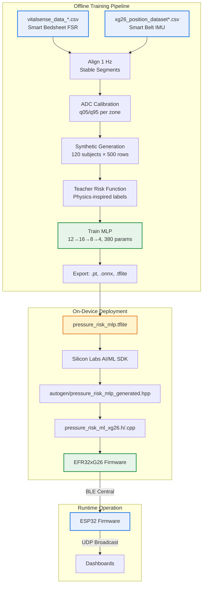

# VitalSense Pipeline

## Overview

The Pipeline directory contains all firmware, machine learning models, dataset generation tools, and synthetic data for the VitalSense pressure ulcer prevention system. This is the core engineering pipeline that transforms raw sensor data into deployed on-device inference.

## Pipeline Components

| Component | Path | Description |
|-----------|------|-------------|
| **ESP32 Firmware** | `ESP32 firmware/` | FSR acquisition, BLE GATT server, UDP broadcaster (Arduino/NimBLE) |
| **EFR32xG26 Firmware** | `EFR xG26 firmware/` | IMU posture detection, TFLite Micro ML inference, BLE central (C/Silicon Labs SDK) |
| **ML Model** | `model/` | Trained model artifacts (PyTorch, ONNX, TFLite) with metadata and conversion scripts |
| **Synthetic Dataset Kit** | `Synthetic dataset kit/` | End-to-end pipeline: source alignment, synthetic generation, training, export |
| **Dataset** | `Dataset/` | Generated synthetic dataset (60K rows) and future generalization plan |

## Data Flow



## Component Details

### ESP32 Firmware (`ESP32 firmware/`)

**File:** `VitalSense_ESP32.ino` (single-file lean build)

| Aspect | Details |
|--------|---------|
| **MCU** | ESP32-C3 (DevKitM-1, SuperMini, etc.) |
| **BLE Stack** | NimBLE-Arduino 2.3.7 (lean, no Arduino BLE) |
| **JSON** | Manual `snprintf` (no ArduinoJson) |
| **ADC** | 12-bit, 8 channels via 74HC4051 MUX |
| **UDP** | Broadcast port 5005, 1 Hz, VitalSense Protocol v1 |
| **Role** | BLE Peripheral (GATT Server) |

**Key Responsibilities:**
- Read 8 FSR sensors via MUX (GPIO 0,2,3,4,5)
- Average pairs into 4 plates: Head, Shoulders, Hips, Heels
- BLE GATT Server: Service `7a0a0001-...`, RX `0x02`, TX `0x03`
- Respond to `0x01` with 18-byte FSR packet
- Receive risk packets `0x02` (×4) and state `0x03` from EFR32
- Broadcast complete JSON every 1 second

### EFR32xG26 Firmware (`EFR xG26 firmware/bt_imu_mode/`)

**Project:** `bt_imu_mode.slcp` (Simplicity Studio)

| Aspect | Details |
|--------|---------|
| **MCU** | EFR32MG26B510F3200IM68 (BRD2608A Dev Kit) |
| **SDK** | Gecko SDK 2026.6.0 |
| **IMU** | ICM-40627 (I²C, ~60 Hz) |
| **ML** | TensorFlow Lite Micro (Silicon Labs AI/ML SDK) |
| **BLE Role** | Central (scans for `VitalSense-ESP32C3`) |
| **Pre-built** | `firmware file/bt_imu_mode.s37` |

**Key Responsibilities:**
- Calibrate CENTER/LEFT/RIGHT postures via BTN0
- Classify posture at 60 Hz, track uninterrupted duration
- After 60s threshold: request FSR scan via `0x01` every 1s
- Decode 8 FSR values, compute 4 plate averages
- Run `pressure_risk_mlp` inference (5 inputs → 4 outputs)
- Send 4 risk packets `0x02` (bodyId, risk 0-100, avoidFlag)
- Send periodic state `0x03` (position, duration, risk summary)

**Button Mapping:**
- BTN0: Calibration sequence (CENTER→LEFT→RIGHT) / Restart calibration
- BTN1: Toggle Awake ↔ Standby

**RGB LED Status:**
- OFF: Standby
- YELLOW: Calibration required
- RED: IMU/ML/BLE error
- BLUE: Scanning
- PURPLE: Connecting/Discovering GATT
- CYAN: Link ready
- GREEN: Waiting for FSR response

### ML Model (`model/`)

**Architecture:**
```
Input (12) → Linear(16) → ReLU → Linear(8) → ReLU → Linear(4) → Sigmoid
```
**Parameters:** 380

**Files:**
| File | Format | Purpose |
|------|--------|---------|
| `pressure_risk_mlp.pt` | PyTorch | Training / fine-tuning / research |
| `pressure_risk_mlp.onnx` | ONNX | Cross-platform inference |
| `pressure_risk_mlp.tflite` | TensorFlow Lite | EFR32xG26 deployment (TFLite Micro) |
| `onnx_test_report.json` | JSON | ONNX vs PyTorch parity verification |
| `onnx_test_predictions.csv` | CSV | Sample predictions for regression testing |

**Inputs (12 features):**
| Index | Feature | Range |
|-------|---------|-------|
| 0 | position_CENTER | {0,1} |
| 1 | position_LEFT | {0,1} |
| 2 | position_RIGHT | {0,1} |
| 3 | log_duration_normalized | [0,1] |
| 4 | head_load | [0,1] |
| 5 | shoulders_load | [0,1] |
| 6 | hips_load | [0,1] |
| 7 | heels_load | [0,1] |
| 8 | head_exposure_scaled | [0,1] |
| 9 | shoulders_exposure_scaled | [0,1] |
| 10 | hips_exposure_scaled | [0,1] |
| 11 | heels_exposure_scaled | [0,1] |

**Outputs (4):** Risk probability [0,1] for Head, Shoulders, Hips, Heels. Firmware scales to 0-100.

**EFR32 C API (5 inputs):**
```c
sl_status_t pressure_risk_ml_init(void);
sl_status_t pressure_risk_ml_predict(
    pressure_position_t position,  // 0=CENTER, 1=LEFT, 2=RIGHT
    uint32_t duration_sec,
    uint16_t head_adc,
    uint16_t shoulders_adc,
    uint16_t hips_adc,
    uint16_t heels_adc,
    pressure_risk_result_t *result);  // 4 scores 0-100
```

### Synthetic Dataset Kit (`Synthetic dataset kit/`)

**Pipeline Script:** `build_pressure_risk_dataset.py`

**Stages:**
1. **Align Sources** — Resample IMU (60 Hz) + FSR (1 Hz) to common 1 Hz timeline
2. **Extract Stable Segments** — Minimum 300s, 20s margin, posture-homogeneous
3. **ADC Calibration** — q05/q95 per zone from bedsheet recording
4. **Generate Synthetic Subjects** — 120 subjects × 500 rows = 60,000 total
   - Sample source stable row matching target posture
   - Apply subject/global/mattress variation (log-normal factors)
   - Add slow drift + measurement noise
   - Convert load → ADC via calibrated q05/q95
   - Compute teacher risk for sampled duration
5. **Train MLP** — PyTorch, subject-wise 80/20 split (96/24 subjects)
6. **Export** — .pt, .onnx, .tflite + metadata JSON

**Teacher Risk Function:**
```python
effective = clip((load - relief_floor) / (1.0 - relief_floor), 0, 1)
dose = effective^pressure_exponent * duration_sec / reference_duration_seconds
risk = 100 * (1 - exp(-risk_gain * dose))
```

| Parameter | Value |
|-----------|-------|
| `reference_duration_seconds` | 7200 (2 hours) |
| `relief_floor` | 0.10 |
| `pressure_exponent` | 1.50 |
| `risk_gain` | 1.50 |
| `low_medium_threshold` | 35.0 |
| `medium_high_threshold` | 70.0 |

**Performance (Test: 12K rows, 24 subjects):**
| Metric | Value |
|--------|-------|
| MAE (0-100) | 1.88 |
| RMSE (0-100) | 2.75 |
| Max Abs Error | 21.19 |
| Highest-risk body part accuracy | 90.2% |
| Highest-risk level accuracy | 97.0% |

### Dataset (`Dataset/`)

| File | Size | Description |
|------|------|-------------|
| `synthetic_pressure_ulcer_risk_dataset.csv` | 18.8 MB | 60,000 rows, 120 subjects |
| `VitalSense_Future_Dataset_Generalization_Plan.md` | — | Roadmap for clinical data integration |

## ADC Calibration (q05 / q95)

Used for ADC → load normalization: `load = clip((adc - q05) / (q95 - q05), 0, 1)`

| Zone | q05 (Low Load) | q95 (High Load) |
|------|----------------|-----------------|
| Head | 3119 | 3932 |
| Shoulders | 3537 | 3994 |
| Hips | 3007 | 3909 |
| Heels | 3222 | 4021 |

## Build Instructions

### ESP32 Firmware
```bash
# Arduino IDE: Open VitalSense_ESP32.ino, configure WiFi, upload
# PlatformIO:
cd "ESP32 firmware"
pio run -e esp32c3 -t upload
```

### EFR32xG26 Firmware
```bash
# Simplicity Studio 5:
# 1. File → Import → Silicon Labs → Project from SLCP
# 2. Select bt_imu_mode.slcp
# 3. Build (hammer) → Flash (debug)
# Post-build for OTA:
commander gbl create output.gbl --app output.s37
```

### ML Pipeline
```bash
cd "Synthetic dataset kit"
pip install numpy pandas torch scikit-learn onnx onnxruntime tf2onnx
python build_pressure_risk_dataset.py

# Convert to TFLite (for EFR32):
python -m tf2onnx.convert --input pressure_risk_mlp.onnx --output pressure_risk_mlp_tf.onnx
tflite_convert --output_file pressure_risk_mlp.tflite --input_file pressure_risk_mlp_tf.onnx
```

## Communication Protocols

### BLE GATT (EFR32 ↔ ESP32)

| Parameter | Value |
|-----------|-------|
| Device Name | `VitalSense-ESP32C3` |
| Service UUID | `7a0a0001-5b8a-4f4c-9d1d-8b4e3d7a1000` |
| RX Char (EFR→ESP) | `7a0a0002-...` (Write w/ Response) |
| TX Char (ESP→EFR) | `7a0a0003-...` (Notify) |

**Commands (EFR→ESP):**
| CMD | Payload | Description |
|-----|---------|-------------|
| `0x01` | — | Request 8-FSR scan |
| `0x02` | `bodyId, risk, avoidFlag` | Risk update (×4) |
| `0x03` | `pos, dur, valid, zone, score, level` | State summary |

**Response (ESP→EFR):** `0x81, 0x08, 8×uint16_le`

### UDP Broadcast (ESP32 → Dashboards)
- **Port:** 5005
- **Interval:** 1000 ms
- **Format:** JSON (VitalSense Protocol v1)

## Third-Party Libraries (EFR32)

| Library | Path | Purpose |
|---------|------|---------|
| TensorFlow Lite Micro | `bt_imu_mode/autogen/ml/third_party/tflm/` | On-device inference |
| FlatBuffers | `.../flatbuffers/` | Model serialization |
| gemmlowp | `.../gemmlowp/` | Low-precision GEMM |
| ruy | `.../ruy/` | Matrix multiplication |

## License

VitalSense project content is licensed under the [Apache License 2.0](../../LICENSE.md).

SPDX-License-Identifier: Apache-2.0  
Copyright 2025 VitalSense Project Contributors

Individual components may have additional licenses:
- EFR32 firmware: Zlib (Silicon Labs)
- Third-party libraries: Respective licenses
