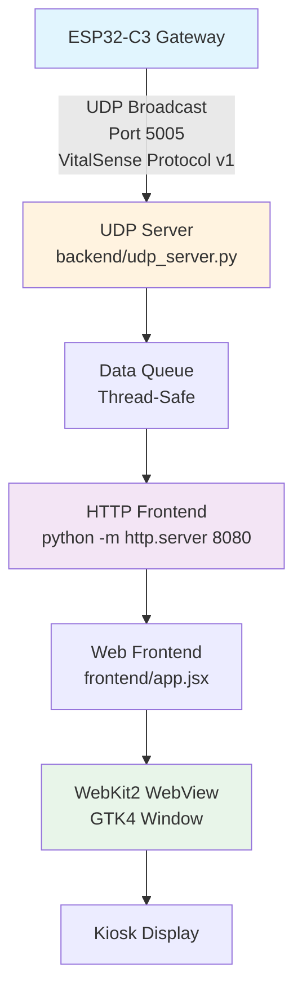

# VitalSense Web Dashboard

## Overview

The VitalSense Web Dashboard is a kiosk-mode application built with Python GTK4 and WebKit2GTK. It receives UDP broadcasts from the ESP32-C3 gateway on port 5005, serves a web-based frontend via an internal HTTP server, and displays real-time patient monitoring data in a full-screen WebView.

## System Architecture



## Components

| Component | Path | Description |
|-----------|------|-------------|
| Application Controller | `app.py` | Main entry point. Orchestrates splash screen, backend, frontend, and WebView lifecycle |
| UDP Server | `backend/udp_server.py` | Listens on 0.0.0.0:5005, parses VitalSense Protocol v1 JSON, pushes to thread-safe queue |
| HTTP Frontend | `frontend/` | Static assets served on port 8080. React-based UI (app.jsx) consuming data via SSE |
| Core Managers | `core/` | BackendManager, FrontendManager, ConfigManager - lifecycle and process management |
| UI Components | `ui/` | SplashScreen, potential AdminLogin/Settings windows |
| Assets | `assets/` | Icons, images, stylesheets |
| Configuration | `config.json` | Network, display, and application settings |

## Prerequisites

- Python 3.10 or higher
- GTK4 development libraries
- WebKit2GTK 4.1 development libraries
- Virtualenv (recommended)

### Ubuntu/Debian
```bash
sudo apt update
sudo apt install python3-gi python3-gi-cairo gir1.2-gtk-4.0 gir1.2-webkit2-4.1 python3-venv
```

### Fedora
```bash
sudo dnf install python3-gobject gtk4-devel webkit2gtk4.1-devel python3-virtualenv
```

## Configuration

Edit `config.json` before first run:

```json
{
  "udp_port": 5005,
  "http_port": 8080,
  "frontend_path": "frontend",
  "splash_duration_ms": 3000,
  "kiosk_mode": true,
  "log_level": "INFO"
}
```

| Field | Type | Default | Description |
|-------|------|---------|-------------|
| `udp_port` | integer | 5005 | UDP listen port for ESP32 broadcasts |
| `http_port` | integer | 8080 | HTTP server port for frontend |
| `frontend_path` | string | "frontend" | Relative path to static assets |
| `splash_duration_ms` | integer | 3000 | Splash screen display time |
| `kiosk_mode` | boolean | true | Full-screen, no window decorations |
| `log_level` | string | "INFO" | Logging verbosity |

## Installation & Execution

### 1. Create Virtual Environment
```bash
cd projects/vitalsense-dashboard
python3 -m venv venv
source venv/bin/activate
```

### 2. Install Python Dependencies
```bash
pip install --upgrade pip
# No additional PyPI packages required for core functionality
# Frontend uses React via CDN in app.jsx
```

### 3. Run Application
```bash
python app.py
```

### 4. Expected Startup Sequence
```
[INFO] Loading configuration from config.json
[INFO] Starting splash screen
[INFO] Starting backend UDP server on 0.0.0.0:5005
[INFO] Starting HTTP frontend on http://127.0.0.1:8080
[INFO] Waiting for frontend to respond...
[INFO] Frontend ready. Launching WebView.
[INFO] Application running in kiosk mode
```

## Protocol Support

The dashboard implements **VitalSense Protocol v1** over UDP:

- **Port:** 5005 (broadcast/subnet)
- **Format:** JSON, one packet per second
- **Key Fields:**
  - `deviceId`, `bed`, `position` (CENTER/LEFT/RIGHT)
  - `positionDuration` (seconds)
  - `plates`: {head, shoulders, hips, heels} ADC averages (0-4095)
  - `fsr`: 8 raw ADC values (0-4095)
  - `risk`: per-zone risk scores 0-100
  - `highestRisk`: {zone, score, level}
  - `avoidReturn`: per-zone flags

Refer to `../vitalsense-app/VitalSense_Dashboard_Integration_Protocol_v1.md` for complete specification.

## Frontend Data Flow

```
UDP Packet Received
        |
        v
Parse JSON -> Validate Schema
        |
        v
Thread-Safe Queue (maxsize=100)
        |
        v
SSE Endpoint (/events) <-- HTTP Server (port 8080)
        |
        v
Frontend (app.jsx) EventSource Connection
        |
        v
React State Update -> UI Re-render
```

## Project Structure

```
vitalsense-dashboard/
├── app.py                    # Main controller (1282 lines)
├── config.json               # Runtime configuration
├── backend/
│   └── udp_server.py         # UDP listener + parser
├── frontend/
│   ├── index.html            # Entry HTML
│   ├── app.jsx               # React application (JSX, babel standalone)
│   └── models/               # Data models / TypeScript interfaces
├── core/
│   ├── backend_manager.py    # Backend process lifecycle
│   ├── frontend_manager.py   # HTTP server lifecycle
│   └── config_manager.py     # Configuration loading
├── ui/
│   └── splash.py             # GTK SplashScreen
├── assets/
│   └── icons/                # Window icons, favicons
├── logs/                     # Rotating log files
└── README.md                 # This file
```

## Development Notes

### Adding New UI Screens
The `app.py` controller defines extension points in `_LIFECYCLE_TRANSITIONS`:
- `on_admin_login` -> `ui.login.AdminLoginWindow`
- `on_settings` -> `ui.settings.SettingsWindow`
- `on_kiosk_mode` -> Toggle full-screen
- `on_restart` / `on_shutdown` -> System integration

Implement the window class in `ui/` and register the factory in `_instantiate_*` methods.

### Logging
Logs written to `logs/vitalsense.log` with rotation (10MB, 5 backups). Console output at configured `log_level`.

### Testing Without Hardware
Run a mock UDP sender:
```bash
python3 -c "
import socket, json, time
sock = socket.socket(socket.AF_INET, socket.SOCK_DGRAM)
sock.setsockopt(socket.SOL_SOCKET, socket.SO_BROADCAST, 1)
packet = {
    'protocol': 1, 'deviceId': 'VS-TEST', 'bed': 1,
    'position': 'LEFT', 'positionDuration': 120,
    'plates': {'head': 2000, 'shoulders': 2500, 'hips': 3000, 'heels': 1800},
    'fsr': [1900,2100,2400,2600,2900,3100,1700,1900],
    'riskValid': True,
    'risk': {'head': 10, 'shoulders': 20, 'hips': 55, 'heels': 5},
    'highestRisk': {'zone': 'HIPS', 'score': 55, 'level': 'MEDIUM'},
    'avoidReturn': {'head': 0, 'shoulders': 0, 'hips': 0, 'heels': 0},
    'uptime': 3600
}
while True:
    sock.sendto(json.dumps(packet).encode(), ('255.255.255.255', 5005))
    time.sleep(1)
"
```

## License

SPDX-License-Identifier: MIT  
Copyright 2025 VitalSense Project Contributors